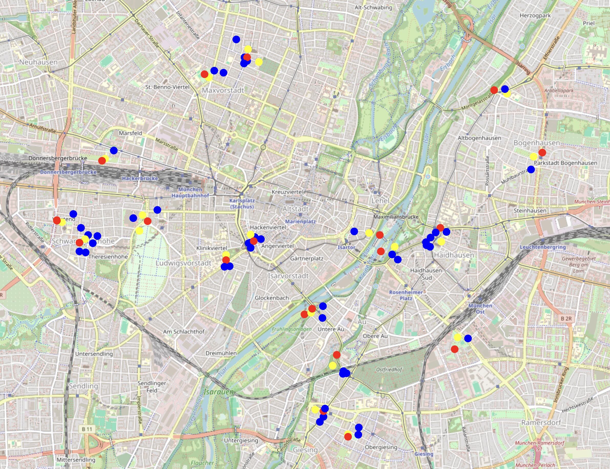

# LOD Use Case Family Spots – Familienfreundliches München: Spielplätze mit nahegelegenen Toiletten und Cafés

## Einleitung

Dieser Use Case identifiziert besonders familienfreundliche Spielplätze, die innerhalb eines Radius von 200 Metern sowohl über mindestens eine öffentliche Toilette als auch ein Café verfügen. Ergänzend wird ausgewiesen, welche dieser Spielplätze zusätzlich einen städtischen Trinkbrunnen in der Nähe haben.
 
Background-Info:
Hierfür wurden offene Datensätze der Landeshauptstadt München zu Spielplätzen, öffentlichen Toiletten und Trinkbrunnen mit Café-Daten aus OpenStreetMap zusammengeführt. Nach der Transformation der heterogenen Daten in RDF wurde ein Wissensgraph aufgebaut, der um geografische Distanzberechnungen erweitert wurde.
 
Die Ergebnisse liefern eine praxisnahe, datenbasierte Entscheidungsgrundlage zur weiteren Planung familienfreundlicher Infrastruktur (z. B. Bau weiterer Toiletten an geeigneten Standorten) und eine Hilfe für Familien, für ihre Bedürfnisse ausgestattete Spielplätze zu identifizieren.

## Datensätze & Lizenzen

- Der Datensatz [Öffentliche Spielplätze](https://open.bydata.de/datasets/0760ce3a-fef8-43e4-888f-8cc92fdf56de) der Landeshauptstadt München (LHM)
  - Die [DCAT-AP.de-Metadaten](https://open.bydata.de/api/hub/repo/distributions/b7754bf1-c799-47bf-8f1a-8cfad0abe9ee.ttl) der CSV-Distribution davon
    - Hier fand die CSV-zu-RDF-Konvertierung bereits im Rahmen eines Experimente-Skripts via CSVW statt und wurde wiederverwendet
  - [Datenlizenz Deutschland – Namensnennung – Version 2.0](https://www.govdata.de/dl-de/by-2-0)
- Der Datensatz [WC-Standorte](https://open.bydata.de/datasets/80832bca-499b-4b24-bb41-9e77f0ef31ee) der LHM
  - Wird zur Bauzeit live über die GeoJSON-Distribution (WFS des Geoportals München) abgefragt; die Koordinaten kommen via `srsName=EPSG:4326` direkt in WGS84 und werden in `build-graph.js` nach RDF konvertiert
  - Die DCAT-Metadaten der Distribution liegen als lokaler Snapshot in [`src/inputs/toilets-distribution.ttl`](src/inputs/toilets-distribution.ttl) (liefert das `dct:modified`)
  - [Datenlizenz Deutschland – Namensnennung – Version 2.0](https://www.govdata.de/dl-de/by-2-0)
- Der Datensatz [Stadtplan der städtischen Trinkbrunnen](https://open.bydata.de/datasets/7e8484f0-12c2-40be-bd0c-cfe04f63a624) der LHM
  - Wird zur Bauzeit live über die GeoJSON-Distribution (WFS des Geoportals München) abgefragt; die Koordinaten kommen via `srsName=EPSG:4326` direkt in WGS84 und werden in `build-graph.js` nach RDF konvertiert
  - Die DCAT-Metadaten der Distribution liegen als lokaler Snapshot in [`src/inputs/trinkbrunnen-distribution.ttl`](src/inputs/trinkbrunnen-distribution.ttl) (liefert das `dct:modified`)
  - [Datenlizenz Deutschland – Namensnennung – Version 2.0](https://www.govdata.de/dl-de/by-2-0)
- Cafés in München von [OpenStreetMap](https://www.openstreetmap.org/#map=19/48.104326/11.597373) via dem [QLever SPARQL-Endpunkt](https://qlever.dev/osm-planet/?query=PREFIX+ogc%3A+%3Chttp%3A%2F%2Fwww.opengis.net%2Frdf%23%3E%0APREFIX+geo%3A+%3Chttp%3A%2F%2Fwww.opengis.net%2Font%2Fgeosparql%23%3E%0APREFIX+geof%3A+%3Chttp%3A%2F%2Fwww.opengis.net%2Fdef%2Ffunction%2Fgeosparql%2F%3E%0APREFIX+geo84%3A+%3Chttp%3A%2F%2Fwww.w3.org%2F2003%2F01%2Fgeo%2Fwgs84_pos%23%3E%0APREFIX+osmkey%3A+%3Chttps%3A%2F%2Fwww.openstreetmap.org%2Fwiki%2FKey%3A%3E%0APREFIX+osmrel%3A+%3Chttps%3A%2F%2Fwww.openstreetmap.org%2Frelation%2F%3E%0APREFIX+schema%3A+%3Chttp%3A%2F%2Fschema.org%2F%3E%0ACONSTRUCT+%7B%0A++%3Fcafe+schema%3Aname+%3Fname+%3B%0A++++++++geo84%3Alat+%3Flat+%3B%0A++++++++geo84%3Alon+%3Flon+.%0A%7D%0AWHERE+%7B%0A++osmrel%3A62428+ogc%3AsfContains+%3Fcafe+.%0A++%3Fcafe+osmkey%3Aamenity+%22cafe%22+%3B%0A++++++++geo%3AhasGeometry%2Fgeo%3AasWKT+%3Fwkt+.%0A++OPTIONAL+%7B+%3Fcafe+osmkey%3Aname+%3Fname+%7D%0A++BIND%28geof%3Acentroid%28%3Fwkt%29+AS+%3Fpt%29%0A++BIND%28geof%3Alatitude%28%3Fpt%29++AS+%3Flat%29%0A++BIND%28geof%3Alongitude%28%3Fpt%29+AS+%3Flon%29%0A%7D)
  - [Open Data Commons Open Database License (ODbL) v1.0](https://opendatacommons.org/licenses/odbl/)

## Vorgehensweise

[Transformation zu RDF und Verschmelzung](src/build-graph.js) zu einem [Wissensgraphen](src/triples.ttl). Dazu wurde ein in-memory Triple Store schrittweise angereichert mit den „RDFizierten“ Datensätzen (Spielplätze + Metadaten); die Café-Daten von OpenStreetMap wurden live per SPARQL CONSTRUCT überführt und die WCs sowie Trinkbrunnen der LHM live als GeoJSON (WFS des Geoportals München) abgefragt und direkt als Triples eingefügt. Comunica, das JavaScript-Framework, das hier für die Queries benutzt wurde, hat im Gegensatz zu Virtuoso keine nativen Geo-Funktionen eingebaut. Daher wurde eine Funktion zur Distanzberechnung per `extensionFunctions` direkt zur QueryEngine hinzugefügt, um sie dann aus der SPARQL-Query heraus nutzen zu können.

Um Trios von Spielplätzen mit nahgelegenen Toiletten und Cafés zu finden, müssen in diesem Fall zwei Distanzen berechnet werden: Spielplatz zu Toilette und Spielplatz zu Café. Um die hierfür erforderliche Rechnenleistung zu minimieren, wurden die Distanzberechnungen auf zwei Queries aufgeteilt und die jeweiligen Treffer (Distanzen unter 200 m) an den Triples der Spielplätze „Hinweise“ angehängt: `dev:hasNearbyToilet` und `dev:hasNearbyCafe`. Analog dazu berechnet eine dritte Query die nahegelegenen Trinkbrunnen und hängt `dev:hasNearbyDrinkingFountain` an. Trinkbrunnen sind dabei kein hartes Kriterium, sondern eine Anreicherung: Ein Spielplatz qualifiziert sich weiterhin über Toilette + Café, und ein etwaiger Trinkbrunnen in der Nähe wird zusätzlich ausgewiesen.

Hier ein Snapshot der daraus resultierenden Triples:

```turtle
dev:playground-1058109 a dev:Playground;
  dct:modified "2024-08-29"^^xsd:date;
  dct:title "Spielplatz \"Kronepark, Am Nockherberg\"";
  geo:lat 48.1202667612206; geo:long 11.58083245436193;
  dev:playgroundTargetGroup "Schulkinder\r\nKleinkinder";
  dev:hasNearbyCafe osm:9362543034;
  dev:hasNearbyToilet dev:wc_finder_opendata.44;
  dev:hasNearbyDrinkingFountain dev:trinkbrunnen.15.

osm:9362543034 a dev:Cafe;
  schema:name "Poppi Farmer";
  geo:lat 48.11961926345; geo:long 11.58256660363.

dev:wc_finder_opendata.44 a dev:PublicToilet;
  geo:lat 48.12147584; geo:long 11.58148544.

dev:trinkbrunnen.15 a dev:DrinkingFountain;
  schema:name "Bertschbrunnen";
  geo:lat 48.12152167; geo:long 11.58030462.
```

Nun können die angereicherten Hinweise genutzt werden, um die Spielplätze einzusammeln ([SPARQL-Query](src/playgrounds-fulfilling-criteria.sparql)). Das Ergebnis sind 27 Spielplätze in München, die das Kernkriterium (Toilette + Café) erfüllen; bei 17 davon liegt zusätzlich ein städtischer Trinkbrunnen in der Nähe:

| playground | lastUpdated | toilets | cafes | drinkingFountains |
| --- | --- | --- | --- | --- |
| Spielplatz "Kronepark, Am Nockherberg" | 2024-08-29 | wc_finder_opendata.44 | Schnecki Back&Bar, Mex Lounge, Poppi Farmer | Bertschbrunnen |
| Spielplatz "Herkomerplatz" | 2024-08-29 | wc_finder_opendata.126 | Bistro+Cafe ÖQ | |
| … | … | … | … | … |

Die genaue Anzahl kann leicht schwanken, da Café-, WC- und Trinkbrunnen-Daten live abgefragt werden (siehe Hinweis unten).

Alle gefundenen Orte können in einer [Karte](src/map.html) eingesehen werden (erzeugt mit [map.js](src/map.js)) bzw. über den Screenshot unten. Zur Erklärung: Spielplätze sind gelb, Toiletten rot, Cafés blau und Trinkbrunnen grün. Manche Spots haben mehrere Toiletten, Cafés und Trinkbrunnen, die weniger als 200 m von „ihrem“ Spielplatz entfernt sind:



Über diese (statische) Karte hinaus gibt es eine [interaktive Variante](src/map-interactive.html) (erzeugt mit [map-interactive.js](src/map-interactive.js)), in der sich die Kriterien live einstellen lassen: Für Toiletten, Cafés und Trinkbrunnen kann jeweils zwischen *Erforderlich*, *Optional* und *Ausgeblendet* umgeschaltet werden, und der Umkreis ist per Schieberegler zwischen 50 und 500 m wählbar. Ein Spielplatz wird angezeigt, wenn er jede *erforderliche* Einrichtung innerhalb des Umkreises hat; *optionale* Einrichtungen werden zusätzlich eingeblendet, wenn sie in der Nähe liegen; *ausgeblendete* Typen bleiben außen vor. Die Voreinstellung (Toilette + Café *erforderlich*, Trinkbrunnen *optional*, 200 m) entspricht der statischen Analyse oben.

Anders als die statische Karte nutzt diese Variante nicht die vorberechneten `dev:hasNearby*`-Kanten, sondern erhält die Rohpunkte (Spielplätze und Einrichtungen) aus dem Wissensgraphen und berechnet die Distanzen direkt im Browser (Haversine in JavaScript). So bleiben der Wissensgraph und die SPARQL-Distanzberechnung unverändert, während Umkreis und Kriterien interaktiv veränderbar sind.

Weitere Informationen über die Entstehungsgeschichte und den Kontext zu diesem Anwendungsfall findet man in [diesem Repo](https://github.com/bydata/open-bydata-lod-usecases).

## Code ausführen

**Um die Ergebnisse zu sehen, muss nichts ausgeführt werden.** Die Karten (einfach [`src/map.html`](src/map.html) bzw. die interaktive Variante [`src/map-interactive.html`](src/map-interactive.html) im Browser öffnen), der fertige Wissensgraph [`src/triples.ttl`](src/triples.ttl) und der Screenshot (siehe oben) liegen bereits im Repo.

**Queries selbst ausführen** (verändert nichts am Repo): Den Wissensgraphen [`src/triples.ttl`](src/triples.ttl) in eine Graph-Datenbank importieren und die Analyse-Query [`playgrounds-fulfilling-criteria.sparql`](src/playgrounds-fulfilling-criteria.sparql) im SPARQL-Editor der Graph-Datenbank ausführen.

**Graph und Karte neu erzeugen** (überschreibt die mitgelieferten Dateien):

```bash
npm install
node src/build-graph.js      # baut src/triples.ttl: Spielplätze aus src/inputs/, Cafés live via OSM, WCs + Trinkbrunnen live via WFS der LHM
node src/map.js              # erzeugt src/map.html aus src/triples.ttl neu
node src/map-interactive.js  # erzeugt src/map-interactive.html (interaktive Variante) aus src/triples.ttl
```

`build-graph.js` liest die vorbereiteten Spielplatz-Daten samt zugehöriger DCAT-Metadaten aus [`src/inputs/`](src/inputs) und reichert sie live an: Cafés über den QLever-OSM-Endpunkt sowie WCs und Trinkbrunnen über die GeoJSON-Distributionen des Geoportals München (Koordinaten direkt in WGS84 via `srsName=EPSG:4326`). Die RDF-Konvertierung der Spielplatz-Daten fand bereits in einer früheren Projektphase statt, bevor dieses Repo für den Anwendungsfall eingerichtet wurde; WCs und Trinkbrunnen werden hingegen zur Bauzeit aus dem WFS konvertiert. Für die WC- und Trinkbrunnen-Datensätze liegt jeweils nur ein DCAT-Metadaten-Snapshot in `src/inputs/` (er liefert das `dct:modified`). Die live abgefragten Café-, WC- und Trinkbrunnen-Daten spiegeln den aktuellen Stand wider und können daher leicht vom mitgelieferten Graphen abweichen.

## Autoren
Dieser Code wurde von [Benjamin Degenhart](https://github.com/benjaminaaron) in Zusammenarbeit mit oc.bydata erstellt.
